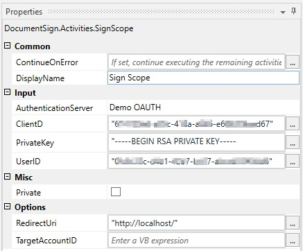
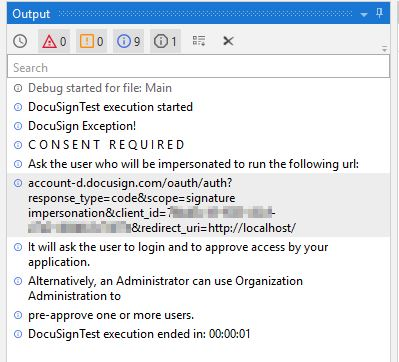


# Document Sign UiPath Activity

A set of activities to interact in a very easy way with DocuSign's API

## Getting Started

To use this Acitivty you need to have UiPath Studio on your machine installed.
Y

### Prerequisites

Install through UiPath Studio Packet Manager:


```
DocuSign.eSign.dll >= 4.2.0
```

If you haven't created an Account yet, please sign on for a developer Account at: https://secure.docusign.com/signup/developer


### Setup

In order to use the SignScope and all underlying activities you need to set up the authorization parameters in the properties of the SignScope Activity.

```
AuthenticationServer
ClientID
PrivateKey
UserID
```


If you created a Demo Account  choose  ```DemoOAUTH``` for ```AuthenticationServer``` 

###### Client ID/Integration Key
To get your Client ID go to the Admin Page (https://admindemo.docusign.com/) of your
DocuSign Account and navigate to "API and Keys"  and hit "Add App / Integration Key"
add an App Name and copy ```Integration Key``` which is know as your ```Client ID```.

###### Private Key
In the same section generate a RSA Key Pair and copy it to Parameter ```PrivateKey```.


###### Redirect URI
You need to configure a Redirect URI to consent one the usage. 
By default the Activity uses "http://localhost/". You can either add this Redirect URI to the Application or use any other Redirect URI.

***Note: The Activity Parameter needs to be the exact same as you entered in the "Redirect URIs" Section.***

###### User ID
Navigate in the Admin Page to Section "Users and Groups" --> "Users" and go to klick on your User and copy the ```API Username```.




## First Run

To get the Activity running you need to get consent the first time you are running with these Autorization Parameters.

Just run the ScopeActivity and you will run into a message in the output



Copy the Link and paste it to your browser. You need to accept consent and you are ready to start through with your solution.

### Create Document

This activity reads the content of the provided file and creates a DocuSign compatible Document Object. 
The DocumentId is needed to reference all your recipients to this document.

```
Give an example
```

### Create Recipient

With this activity you create a Recipient with a certain Role and you also define Signature details.
You always have to provide:
`Full Legal Name`, `EmailAddress `, `Role`, `DocumentId`

For Role Types check: https://developers.docusign.com/esign-rest-api/guides/concepts/recipients#recipient-types

##### Definition of a Signer
If you would like to define a signer for a previously created document you provide to this activity:
- ```DocumentId``` Provide the DocumentId of the 'Create Document Activity'
- ```Role``` : `Signer`
- ```Routing Order``` Order for Sequential Routing (0 = First Signer , 1 = Second Signer etc.)
- ```SignatureAnchor``` The Anchor text for autoplacing the 'Sign Here' field in the Document.
- ```Offset``` You can optionally provide an offset for the Signature Field. E.g. to place it directly in the signature area.


### Define Envelope

This function wraps all your created documents and your linked recipients in one envelope.


### Send Envelope

Tihs function will finalize your Envelope Creation and sent out the documents to your recipients in corresponding routing order.
Just provide the Envelope Object and a Emails Subject.

Return values will be the unique Envelope ID and the Status. 

### Download Envelope Documents

With this Activity you can download the document file in its current state (unsigned, partially signed, fully signed etc.) to any location you provide.

The Activity will download the files and will return the list of Filepaths where files have been saved to.

### Get Envelope Information

With this Acitivty you can get a bunch of Information about the Envelope you requested. 
For example: With this function you can track the status of a certain envelope. 

### List Envelopes

With this activity you can filter on your account for envelopes with many options. 
There are some restrictions on polling status of envelopes. Please check: 
https://developers.docusign.com/esign-rest-api/code-examples/code-example-list-envelope-status-changes


## Built With

* [Visual Studio](https://visualstudio.microsoft.com/de/vs/) - Visual Studio 2019
* [UiPath Activity Creator](https://docs.uipath.com/releasenotes/docs/uipath-activity-creator) - UiPath Acvitiy Creator Extension vor VS2019 = 2.2.2
* [UiPath Studio](https://www.uipath.com/de/) - UiPath Studio 19.10.1

## Authors

* **Timo Winter** - *Initial work* 

## Acknowledgments

* Parts of Code Examples of https://developers.docusign.com/esign-rest-api/code-examples/ are used in this project